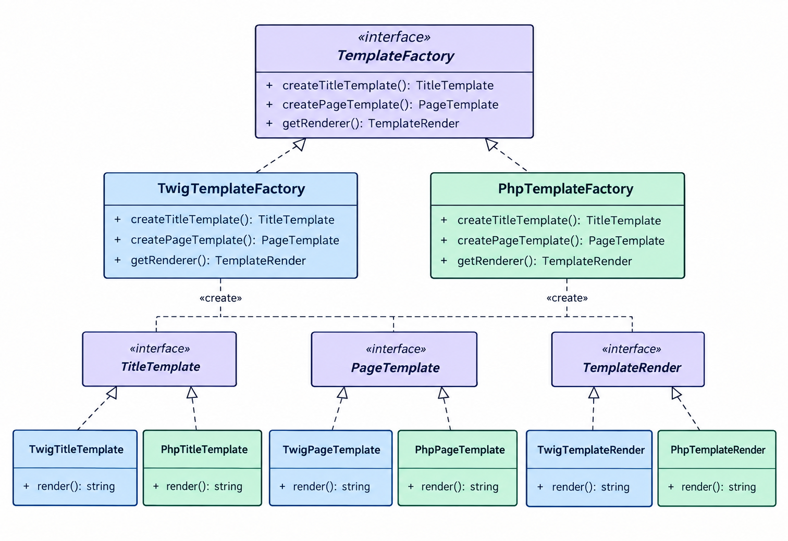

# 🏭 Abstract Factory Pattern

## 📑 Índice

1. [¿Qué es el patrón de diseño Abstract factory?](#1-qué-es-el-patrón-de-diseño-Abstract-Factory)
2. [¿Cómo funciona el patrón de diseño Abstract Factory](#2-cómo-funciona-el-patrón-de-diseño-Abstract-Factory)
3. [¿Cuándo usar el patrón de diseño Abstract Factory?](#3-cuándo-usar-el-patrón-de-diseño-Abstract-Factory)
4. [Ejemplo](#4-ejemplo)
5. [Diagrama UML](#5-diagrama-uml)
6. [Configuración](#6-configuración)
7. [¿Cómo ejecutarlo?](#7-cómo-ejecutarlo)


8. [¿Cómo implementar el patrón para resolver el problema?](#cómo-implementar-el-patrón-para-resolver-el-problema)
9. [Proceso de codificación](#proceso-de-codificación)
   1. [Identificar los productos a fabricar](#1-identificar-los-productos-a-fabricar)
   2. [Crear las clases concretas de productos](#2-crear-las-clases-concretas-de-productos)
   3. [Crear las clases de renderizado concretas](#3-crear-las-clases-de-renderizado-concretas)
   4. [Crear la fábrica abstracta](#4-crear-la-fábrica-abstracta)
   5. [Crear las fábricas concretas](#5-crear-las-fábricas-concretas)
   6. [Crear la clase cliente Page](#6-crear-la-clase-cliente-page)
10. [Estructura del proyecto](#estructura-del-proyecto)
11. [Ejemplo de ejecución con la familia PhpTemplateFactory](#ejemplo-de-ejecución-con-la-familia-phptemplatefactory)
   1. [Instanciación de Page](#1-instanciación-de-page)
   2. [Llamada al método render de Page](#2-llamada-al-método-render-de-page)
   3. [Uso de la fábrica dentro de Page::render()](#3-uso-de-la-fábrica-dentro-de-pagerender)
   4. [Renderizado del contenido final](#4-renderizado-del-contenido-final)
   5. [Sustitución de valores en la plantilla](#5-sustitución-de-valores-en-la-plantilla)
   6. [Retorno del contenido HTML final](#6-retorno-del-contenido-html-final)
   7. [Diagrama de secuencia](#7-diagrama-de-secuencia)


---


## 1. ¿Qué es el patrón de diseño Abstract Factory?

El Abstract Factory (o fábrica abstracta) es un patrón de diseño que funciona como una "fábrica de fábricas". Su objetivo principal es agrupar un conjunto de fábricas individuales que tienen algo en común sin que el código principal necesite saber los detalles específicos de cómo se construyen. En palabras simples, es una superestructura que te permite crear familias de objetos relacionados (como botones, ventanas y menús) garantizando que todos compartan el mismo estilo o configuración 

## 2. ¿Cómo funciona el patrón de diseño Abstract Factory?

Este patrón funciona mediante interfaces o planos generales. Primero, se define una fábrica abstracta (el plano básico) que dice qué cosas se pueden fabricar, pero no cómo hacerlas. Luego, se crean las fábricas concretas (las verdaderas constructoras) que siguen ese plano para hacer los productos reales. Por ejemplo, si tienes una fábrica abstracta de muebles, tendrás una fábrica concreta de "muebles modernos" y otra de "muebles clásicos". El programa principal solo le pide cosas a la fábrica general, y esta se encarga de entregar automáticamente la versión correcta de los objetos según el estilo elegido.

## 3. ¿Cuándo usar el patrón de diseño Abstract Factory?

Debes usar este patrón cuando tu programa necesite trabajar con múltiples familias de productos que deben usarse juntos y quieres asegurarte de que no se mezclen estilos diferentes. Un caso muy común es cuando creas una aplicación que debe verse nativa tanto en Windows como en Mac; la fábrica te asegura que si estás en Mac, todos los botones y menús sean estilo Mac y no se cuele uno de Windows. También es ideal cuando quieres que tu código sea fácil de ampliar en el futuro (por ejemplo, añadir soporte para Linux) sin tener que modificar o romper las partes del programa que ya funcionan.

## 4. Ejemplo

En este ejemplo, el objetivo es crear un sistema que permita generar plantillas dinámicamente usando distintos motores de renderizado —Twig y PHPTemplate— sin modificar el código principal. Cada motor produce sus propias versiones de los mismos productos: una plantilla de título, una plantilla de página y un renderizador. Para lograrlo, utilizamos una fábrica abstracta que define qué productos deben crearse, y fábricas concretas (Twig y PHP) que implementan esa lógica según el motor seleccionado.

El resultado es un sistema más modular, extensible y fácil de mantener.

## 5. Diagrama UML



## 6. Configuración

Configuración del sistema de carga automática, generar el mapa de clases (autoload para psr-4):

Abre tu terminal, asegúrate de estar en **cd Patrones/Creacionales/AbstractFactory/Ejemplo-php-1/AbstractFactory** (donde está el archivo `composer.json`) y ejecuta el siguiente comando:

**Si es la primera vez:**

```bash
composer install
``` 

**O si requieres actualizar:**

```bash
composer dump-autoload
```
Verificar la creación correcta de la carpeta **vendor** en el directorio : Patrones/Creacionales/FactoryMethod/Ejemplo1-php/FactoryMethod. 

**¿Qué hace esto?** Composer lee tu JSON, busca la carpeta `src/` y genera los archivos internos necesarios dentro de `vendor/` para que la magia de la autocarga funcione.

## 7.¿Cómo ejecutarlo? 

```bash
php Patrones/Creacionales/AbstractFactory/Ejemplo-php-1/AbstractFactory/src/index.php
```

Resultado:

```
Testing actual rendering with the PHPTemplate factory:
<div class="page">
    <h1> Sample page </h1>
    <article class="content">This is the body.</article>
</div>

Testing actual rendering with the TwigTemplate factory:
<div class="page">
    <h1> Sample page </h1>
    <article class="content">This is the body.</article>
</div>
```


---

## ¿Cómo implementar el patrón para resolver el problema?

Como mencionamos anteriormente, el objetivo del patrón Abstract Factory es permitir la creación de familias de objetos relacionados entre sí, sin que el código cliente tenga que conocer las clases concretas que se están instanciando.

En nuestro ejemplo, los objetos que necesitamos crear son:

* TitleTemplate → título.
* PageTemplate → página.
* TemplateRender → renderizado.

Cada uno representa un tipo diferente de objeto y cuenta con su propia interfaz.

Pero entonces surge una pregunta importante:

¿Qué relación existe entre estos tres objetos?

La relación está en el motor de plantillas al que pertenecen.

En nuestro ejemplo tenemos dos motores:

* Twig
* PHPTemplate

Estos motores representan nuestras familias de productos o fabricas concretas.

Por lo tanto, necesitamos crear una familia completa de objetos para cada motor.
Cada fábrica será responsable de crear todos los productos pertenecientes a su propia familia.

### Familia Twig
Para Twig necesitamos la fabrica concreta (TwigTemplateFactory) que crea lo siguientes objetos :
* Un objeto título de tipo Twig. (TwingTitleTemplate.php)
* Un objeto página de tipo Twig. (TwingPageTemplate.php)
* Un objeto renderizador de tipo Twig. (TwingRender.php)

### Familia PHPTemplate
Para PHPTemplate necesitamos la fabrica concreta (PhpTemplateFactory) que crea lo siguientes objetos:
* Un objeto título de tipo PHPTemplate. (PhpTitleTemplate.php)
* Un objeto página de tipo PHPTemplate. (PhpPageTemplate.php)
* Un objeto renderizador de tipo PHPTemplate. (PHPTemplateRenderer.php)

De esta manera, podemos observar que cada familia está compuesta por diferentes tipos de productos que trabajan juntos.

---

### ¿Dónde está la fábrica abstracta?

Aquí es donde aparece TemplateFactory.

La fábrica abstracta es una interfaz que define el contrato general que deberán cumplir todas nuestras fábricas concretas.

En nuestro caso:

```php
interface TemplateFactory
{
    public function createTitleTemplate(): TitleTemplate;
    public function createPageTemplate(): PageTemplate;
    public function getRenderer(): TemplateRender;
}
```

Observa que estos métodos no contienen la implementación de cómo crear los objetos. Solamente indican qué productos debe ser capaz de crear cualquier fábrica de plantillas.

Además, los métodos retornan interfaces, no clases concretas:

* `createTitleTemplate()` retorna `TitleTemplate`.
* `createPageTemplate()` retorna `PageTemplate`.
* `getRenderer()` retorna `TemplateRender`.

Esto es importante porque permite que el código cliente trabaje con abstracciones y no dependa directamente de `TwigTitleTemplate`, `PhpTitleTemplate`, etc.


---

##  Proceso de codificación

### 1. Identificar los productos a fabricar

Los productos que queremos que nuestras fábricas creen son:

* `TitleTemplate`: plantilla de título.
* `PageTemplate`: plantilla de página.
* `TemplateRenderer`: renderizador.

Por lo tanto, creamos una interfaz para cada uno:

```bash
Template/
│   ├── TitleTemplate.php     ← Interfaz
│   └── PageTemplate.php      ← Interfaz
Renderer/
│   └── TemplateRenderer.php  ← Interfaz
```

### 2. Crear las clases concretas de productos

Como tenemos dos motores de plantillas, necesitaremos implementaciones concretas para cada uno.
Además, creamos una clase abstracta para evitar repetir código en las clases de página.

```bash
Template/
│   ├── TwigTitleTemplate.php           ← Implementa TitleTemplate
│   ├── TwigPageTemplate.php            ← Extiende BasePageTemplate
│   ├── PHPTemplateTitleTemplate.php    ← Implementa TitleTemplate
│   ├── PHPTemplatePageTemplate.php     ← Extiende BasePageTemplate
│   └── BasePageTemplate.php            ← Clase abstracta común
```

¿Por qué se usa `BasePageTemplate`?

Para evitar duplicar lógica que comparten `TwigPageTemplate` y `PHPTemplatePageTemplate`, como la propiedad `$titleTemplate`.

### 3. Crear las clases de renderizado concretas

Cada motor tiene su propia clase que implementa `TemplateRenderer` y sabe cómo renderizar:

```bash
Renderer/
│   ├── TwigRenderer.php            ← Implementa TemplateRenderer
│   └── PHPTemplateRenderer.php     ← Implementa TemplateRenderer
```

### 4. Crear la fábrica abstracta

Creamos una interfaz que defina los métodos para fabricar cada tipo de producto:

`TemplateFactory.php` ← Interfaz abstracta

Métodos:

* `createTitleTemplate(): TitleTemplate`
* `createPageTemplate(TitleTemplate $title): PageTemplate`
* `getRenderer(): TemplateRenderer`

### 5. Crear las fábricas concretas

Estas clases implementan `TemplateFactory` y se encargan de crear productos específicos para cada motor:

```bash
Factory/
│   ├── TwigTemplateFactory.php        ← Implementa TemplateFactory
│   └── PHPTemplateFactory.php         ← Implementa TemplateFactory
```

Cada una sabe cómo construir títulos, páginas y renderizadores según su motor.

### 6. Crear la clase cliente (Page)

La clase `Page` actúa como cliente y utiliza una fábrica para generar los componentes necesarios sin saber su implementación concreta.

```php
$page = new Page('Título', 'Contenido');
```

---

## 📁 Estructura del proyecto

```bash
/src
│
├── Client/
│   └── Page.php                       # Cliente que usa la fábrica
│
├── Engine/
│   └── Twing.php                      # Simulación del motor Twig
│
├── Factory/
│   ├── TemplateFactory.php           # Interfaz abstracta
│   ├── TwigTemplateFactory.php       # Implementación concreta Twig
│   └── PhpTemplateFactory.php        # Implementación concreta PHP
│
├── Render/
│   ├── TemplateRender.php            # Interfaz del renderizador
│   ├── TwingRender.php               # Implementación concreta Twig
│   └── PHPTemplateRenderer.php       # Implementación concreta PHP
│
├── Template/
│   ├── TitleTemplate.php             # Interfaz del título
│   ├── PageTemplate.php              # Interfaz de página
│   ├── BasePageTemplate.php          # Clase base para plantillas de página
│   ├── TwigTitleTemplate.php         # Título con sintaxis Twig
│   ├── PhpTitleTemplate.php          # Título con sintaxis PHP
│   ├── TwigPageTemplate.php          # Página con sintaxis Twig
│   └── PhpPageTemplate.php           # Página con sintaxis PHP
│
├── Diagramas/
│   └── AbstractFactory.png           # Diagrama ilustrativo
│
├── index.php                         # Archivo de prueba
└── README.md                         # Este archivo
```

---

## 🔵 Ejemplo de ejecución con la familia PhpTemplateFactory

Tomando como ejemplo la fábrica `PHPTemplateFactory`, el flujo de ejecución es el siguiente:

### 1. Instanciación de Page

En `index.php` se crea una instancia de la clase `Page`, pasándole como argumentos un título y un contenido:

```php
$page = new Page('Sample page', 'This is the body.');
```

Esto llama al constructor de la clase `Page`, almacenando internamente los valores:
* `$this->title = 'Sample page'`
* `$this->content = 'This is the body.'`

### 2. Llamada al método render de Page

Luego se llama al método `render()` del objeto `$page`, pasándole como argumento una instancia de la fábrica concreta `PHPTemplateFactory`:

```php
echo $page->render(new PHPTemplateFactory());
```

### 3. Uso de la fábrica dentro de Page::render()

Dentro del método `render()` de la clase `Page`, se reciben los siguientes objetos a través de la fábrica:

a) Creación del template de página

```php
$pageTemplate = $factory->createPageTemplate();
```

Esto ejecuta el método `createPageTemplate()` de `PHPTemplateFactory`, que:
* Llama internamente a `createTitleTemplate()` para generar un objeto `PhpTitleTemplate`.
* Con ese objeto, instancia `PhpPageTemplate`, que lo recibe en su constructor.
* Retorna finalmente el objeto `PhpPageTemplate`.

b) Obtención del renderer

```php
$renderer = $factory->getRenderer();
```

Este método retorna una instancia de `PHPTemplateRenderer`.

### 4. Renderizado del contenido final

Se llama al método `render()` del renderer, pasando como parámetros:
* La plantilla HTML obtenida de `$pageTemplate->getTemplateString()`, que contiene placeholders como `{{title}}` y `{{content}}`.
* Un arreglo asociativo con los valores reales:

```php
[
  'title' => $this->title,       // 'Sample page'
  'content' => $this->content    // 'This is the body.'
]
```

### 5. Sustitución de valores en la plantilla

Dentro del método `render()` de `PHPTemplateRenderer`, se recorren las claves del arreglo asociativo y se sustituyen en el string HTML. Por ejemplo:

```php
$templateString = str_replace('{{title}}', 'Sample page', $templateString);
$templateString = str_replace('{{content}}', 'This is the body.', $templateString);
```

### 6. Retorno del contenido HTML final

El string HTML con los valores reemplazados es retornado desde `PHPTemplateRenderer`, luego desde `Page::render()` y finalmente impreso con `echo` en `index.php`.

### 7. Diagrama de secuencia


---

##  Resultado esperado

```bash
Testing actual rendering with the PHPTemplate factory:
<div class="page">
    <h1>Sample page</h1>
    <article class="content">This is the body.</article>
</div>
```


