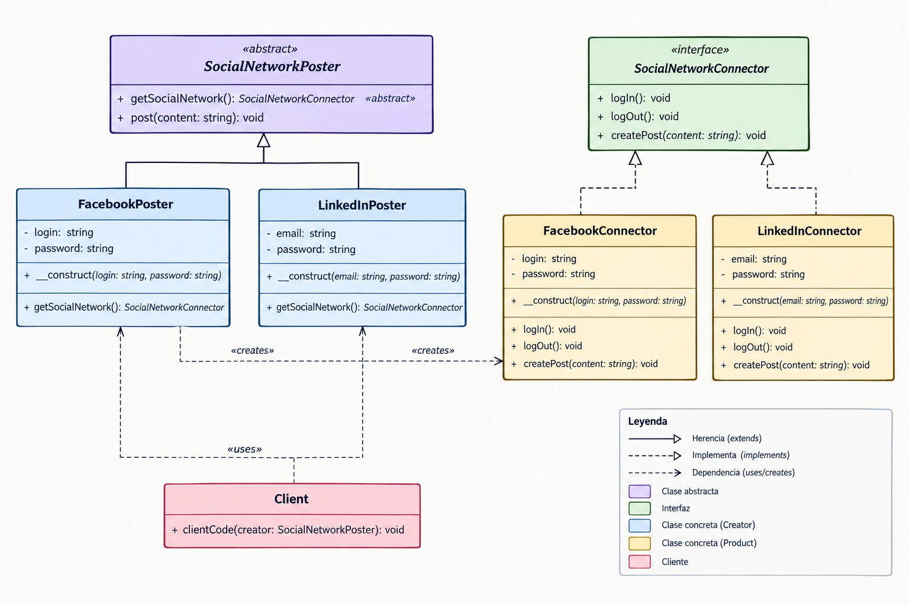

# Patrón de Diseño Factory Method

## Índice

1. [¿Qué es el patrón de diseño Factory Method?](#1-que-es-el-patron-de-diseno-factory-method)
2. [¿Cómo funciona el patrón de diseño Factory Method?](#2-como-funciona-el-patron-de-diseno-factory-method)
3. [¿Cuándo usar el patrón de diseño Factory Method?](#3-cuando-usar-el-patron-de-diseno-factory-method)
4. [Ejemplo](#4-ejemplo)
5. [Diagrama UML](#5-diagrama-uml)
6. [Configuración del sistema de carga automática](#6-configuracion-del-sistema-de-carga-automatica)
7. [¿Cómo ejecutarlo?](#7-¿Cómo-ejecutarlo?)

---

## 1. ¿Qué es el patrón de diseño Factory Method?

El Factory Method es un patrón de diseño que sirve para crear objetos sin tener que usar la palabra clave `new` directamente en el código principal. Es como tener una "fábrica virtual" encargada de construir los productos por ti, centralizando la lógica de creación en un solo lugar.

## 2. ¿Cómo funciona el patrón de diseño Factory Method?

Funciona definiendo una clase base (la fábrica) con un método especial para crear objetos, pero deja que sean sus subclases las que decidan qué producto específico fabricar. De este modo, el código principal solo interactúa con una interfaz general y se desentiende de los detalles de cómo se construye cada objeto.

## 3. ¿Cuándo usar el patrón de diseño Factory Method?

Debes usarlo cuando tu código no sabe de antemano el tipo exacto de objeto que necesitará o cuando quieres que tu sistema sea fácil de extender. Es ideal si planeas añadir nuevos tipos de productos en el futuro, ya que podrás hacerlo creando una nueva subclase sin tocar ni romper el código que ya funciona.

## 4. Ejemplo

En este ejemplo, el patrón Factory Method proporciona una interfaz para crear conectores en redes sociales, que pueden utilizarse para iniciar sesión en la red, crear publicaciones y cerrar sesión en la red.

- Se tiene la fábrica `FacebookPoster` que fabrica objetos de tipo `FacebookConnector`.
- Se tiene la fábrica `LinkedInPoster` que fabrica objetos de tipo `LinkedInConnector`.

## 5. Diagrama UML



## 6. Configuración del sistema de carga automática

Generar el mapa de clases (En la terminal):

Abre tu terminal, asegúrate de estar en la raíz de tu proyecto (donde está el archivo `composer.json`) y ejecuta el siguiente comando:

**Si es la primera vez:**

```bash
composer install
```

**O si requieres actualizar:**

```bash
composer dump-autoload
```

**¿Qué hace esto?** Composer lee tu JSON, busca la carpeta `src/` y genera los archivos internos necesarios dentro de `vendor/` para que la magia de la autocarga funcione.

## 7.¿Cómo ejecutarlo? 
Estando en la carpeta Patrones
```bash
php Patrones/Creacionales/FactoryMethod/Ejemplo1-php/FactoryMethod/src/index.php

```
