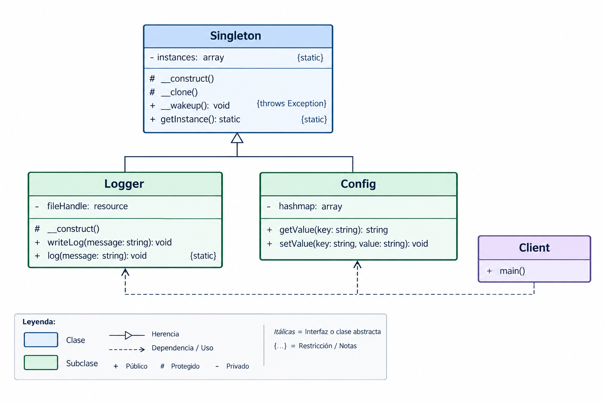

# Patrón de Diseño Singleton

## Índice

1. [¿Qué es el patrón de diseño Singleton?](#1-qué-es-el-patrón-de-diseño-singleton)
2. [¿Cómo funciona el patrón de diseño Singleton?](#2-cómo-funciona-el-patrón-de-diseño-singleton)
3. [¿Cuándo usar el patrón de diseño Singleton?](#3-cuándo-usar-el-patrón-de-diseño-singleton)
4. [Ejemplo](#4-ejemplo)
5. [Diagrama UML](#5-diagrama-uml)
6. [Configuración](#6-configuración)
7. [¿Cómo ejecutarlo?](#7-cómo-ejecutarlo)

---

## 1. ¿Qué es el patrón de diseño Singleton?
Singleton es un patrón de diseño creacional que nos permite asegurarnos de que una clase tenga una única instancia, a la vez que proporciona un punto de acceso global a dicha instancia.


## 2. ¿Cómo funciona el patrón de diseño Singleton?
Este patrón funciona ocultando el constructor de la clase para que nadie pueda usar el comando new de forma libre. En su lugar, se crea un método especial dentro de la misma clase (generalmente llamado getInstance). Cuando pides el objeto por primera vez, el método lo crea y lo guarda; las siguientes veces que lo pides, simplemente te devuelve el que ya estaba guardado en la memoria.

## 3. ¿Cuándo usar el patrón de diseño Singleton?

Debes usar el patrón Singleton cuando necesites un control centralizado de un recurso compartido que no deba duplicarse. Los casos más comunes son la gestión de una conexión a una base de datos, el manejo de un archivo de configuración global, o la creación de un sistema de registro de errores (logger). Usarlo evita que diferentes partes del programa abran conexiones innecesarias y consuman la memoria del sistema.

## 4. Ejemplo

En este ejemplo, el patrón Singleton esuelve la necesidad de garantizar que  las clases (Logger y Config) tengan una única instancia durante la ejecución de la aplicación y proporcionar un punto de acceso global a ellas. Para lograrlo, se crea una clase base Singleton que controla la creación de instancias y evita que sean clonadas o creadas directamente. Las clases Logger y Config heredan este comportamiento y utilizan getInstance() para obtener siempre la misma instancia, permitiendo compartir de forma controlada recursos como los registros y la configuración de la aplicación.

## 5. Diagrama UML



## 6. Configuración


## 7.¿Cómo ejecutarlo? 

```bash
php Patrones/Creacionales/Singleton/Ejemplo1-php/Singleton/src/index.php
   

```